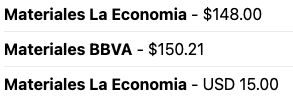

# Product Prices Web Component

A web component that displays a list of prices for a specific product SKU from commercetools. The component fetches product data and displays all available prices with their respective channel names.


    
## Usage

```html
<product-prices
  baseurl="https://your-api-url"
  sku="your-product-sku"
  price-currency="EUR"
  price-country="DE"
  locale="en">
</product-prices>
```

## Attributes

| Attribute | Description | Required |
|-----------|-------------|----------|
| `baseurl` | Base URL for the API endpoint | Yes |
| `sku` | Product SKU to fetch prices for | Yes |
| `price-currency` | Currency code for price filtering | No |
| `price-country` | Country code for price filtering | No |
| `locale` | Locale for channel name display (e.g., "en-US", "es-MX") | Yes |

## API Endpoint

The component makes a GET request to:
```
{baseurl}/products/sku/{sku}?priceCountry={priceCountry}&priceCurrency={priceCurrency}
```

The endpoint should return a commercetools ProductProjection type with expanded prices and channels.

## Display Format

Prices are displayed in the following format:
```
Channel Name - Formatted Price
```

For example:
```
Retail Channel - €99.99
Online Store - €89.99
```

## Styling

The component uses Shadow DOM for style encapsulation. The prices are displayed in a clean list format with the following CSS customizations:
- Channel names are displayed in bold
- Each price item has a bottom border (except the last item)
- System font stack for optimal readability
- Error messages are displayed in red

## Error Handling

The component handles errors gracefully:
- Displays an error message if the API request fails
- Shows "No prices available" if the product has no prices
- Skips rendering if required attributes (baseurl, sku) are missing 