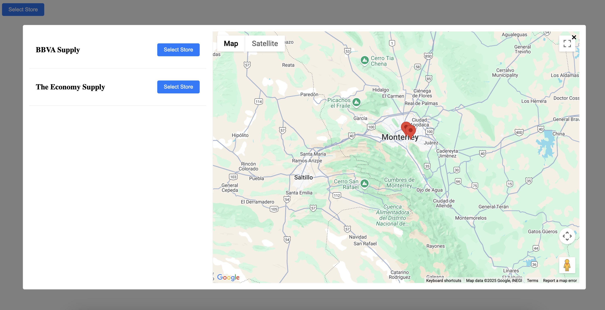

# StoresMap Web Component

A customizable store locator component with Google Maps integration.



## Usage

```html
<stores-map 
  base-url="<deployed-service-url>"
  locale="en-US"
  selected-store-id="store123">
  <span slot="trigger">Select Store</span>
</stores-map>
```

## Properties

| Property | Type | Description |
|----------|------|-------------|
| `base-url` | string | Base URL for API endpoints |
| `locale` | string | Locale for store information |
| `selected-store-id` | string | Pre-selected store ID |

## Slots

| Name | Description |
|------|-------------|
| `trigger` | Content for the trigger button. Defaults to "Select Store" if not provided |

## Events

| Name | Detail | Description |
|------|--------|-------------|
| `storeSelected` | `Store` | Fired when a store is selected. Contains the complete store object |

## CSS Customization

### Main Component
```css
--stores-map-button-padding: 0.5rem 1rem;
--stores-map-button-bg: #007bff;
--stores-map-button-color: white;
--stores-map-button-radius: 4px;
--stores-map-modal-bg: rgba(0, 0, 0, 0.5);
--stores-map-modal-content-bg: white;
--stores-map-modal-padding: 1rem;
--stores-map-modal-radius: 4px;
--stores-map-modal-width: 90vw;
--stores-map-modal-height: 80vh;
--stores-map-divider: 1px solid #eee;
--stores-map-error-color: red;
```

### Error
```css
--stores-map-error-color: red;
--stores-map-error-bg: #fff3f3;
--stores-map-error-border: 1px solid #ffcdd2;
--stores-map-error-radius: 4px;
--stores-map-error-padding: 1rem;
--stores-map-error-font-size: 1rem;
```

### Stores List
```css
--stores-list-item-padding: 1rem;
--stores-list-item-border: 1px solid #eee;
--stores-list-item-bg: white;
--stores-list-item-selected-bg: #f0f0f0;
--stores-list-button-padding: 0.5rem 1rem;
--stores-list-button-bg: #007bff;
--stores-list-button-color: white;
--stores-list-button-radius: 4px;
--stores-list-button-height: 2rem;
--stores-list-button-disabled-bg: #cccccc;
--stores-list-button-disabled-opacity: 0.7;
```

## Examples

### Basic Usage
```html
<stores-map base-url="/api"></stores-map>
```

### With Custom Trigger Button
```html
<stores-map base-url="/api">
  <div slot="trigger">
    
    <strong>Find a Store</strong>
  </div>
</stores-map>
```

### With Custom Styling
```html
<style>
  stores-map {
    --stores-map-button-bg: #4CAF50;
    --stores-map-modal-width: 95vw;
    --stores-list-item-selected-bg: #e8f5e9;
    --stores-list-button-bg: #2E7D32;
  }
</style>

<stores-map base-url="/api"></stores-map>
```

### With Pre-selected Store and Locale
```html
<stores-map 
  base-url="/api"
  selected-store-id="store123"
  locale="en-US">
</stores-map>
```

## Session Storage

The component stores the selected store in session storage using the key format: `web-component_stores-map`. The entire store object is stored for persistence across page reloads.
